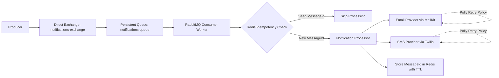

# .NET 9 Notification Microservice (RabbitMQ & Redis)

A high-performance, idempotent notification consumer that processes messages from RabbitMQ and routes them to Email or SMS providers.

## Tech Stack
- .NET 9 Worker Service
- RabbitMQ (`RabbitMQ.Client`)
- Redis
- Polly
- MailKit
- Twilio
- Docker and Docker Compose

## Architecture
The service follows an Exchange-Queue messaging model for reliable asynchronous delivery:

- Producers publish notification events to a **Direct Exchange** (`notifications-exchange`).
- The exchange routes messages to a **persistent queue** (`notifications-queue`).
- The consumer worker reads from the queue, performs Redis idempotency checks, and invokes the Email/SMS processor.
- Messages are acknowledged only after successful processing to support reliable delivery semantics.



## Environment Configuration
Create a `.env` file from the template:

```bash
cp .env.template .env
```

| Variable | Description | Example |
|---|---|---|
| `RABBITMQ_HOST` | RabbitMQ server hostname used by the consumer. | `rabbitmq` |
| `RABBITMQ_USER` | RabbitMQ username. | `guest` |
| `RABBITMQ_PASS` | RabbitMQ password. | `guest` |
| `RABBITMQ_PORT` | RabbitMQ AMQP port. | `5672` |
| `REDIS_CONNECTION_STRING` | Redis endpoint used for idempotency keys. | `redis:6379` |
| `SMTP_HOST` | SMTP server host for email sending. | `smtp.example.com` |
| `SMTP_PORT` | SMTP server port. | `587` |
| `SMTP_USER` | SMTP username/from address. | `notifications@example.com` |
| `SMTP_PASS` | SMTP password/app password. | `your-smtp-password` |
| `TWILIO_SID` | Twilio Account SID. | `your-twilio-account-sid` |
| `TWILIO_TOKEN` | Twilio Auth Token. | `your-twilio-auth-token` |
| `TWILIO_PHONE_NUMBER` | Twilio sender phone number in E.164 format. | `+15005550006` |

## Running the Project
1. Ensure Docker and Docker Compose are installed.
2. Copy the environment template and set real credentials:
   ```bash
   cp .env.template .env
   ```
3. Start the full stack:
   ```bash
   docker compose up --build
   ```
4. Open RabbitMQ Management Dashboard at `http://localhost:15672`.
5. Stop services when needed:
   ```bash
   docker compose down
   ```

## Features
### Idempotency with Redis
- Each notification uses `MessageId` as a deduplication key.
- Processed IDs are stored in Redis with expiration to prevent duplicate delivery.

### Polly Retries
- Email and SMS channels use exponential backoff retry policies.
- Retries reduce transient provider failures without dropping messages.

## Notes
`docker-compose.yml` injects application settings via environment variables so secrets and environment-specific values stay outside source code.
