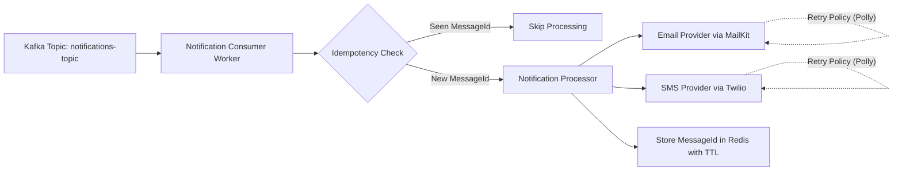

# .NET 9 Notification Microservice (Kafka & Redis)

A high-performance, idempotent consumer service designed to process and route notifications from Kafka to external providers (Email and SMS).

## Tech Stack
- ASP.NET Core 9
- Apache Kafka
- Redis
- Docker & Docker Compose
- Polly
- MailKit
- Twilio

## Architecture


## Environment Configuration
Create a `.env` file from the template:

```bash
cp .env.template .env
```

| Variable | Description | Example |
|---|---|---|
| `KAFKA_BOOTSTRAP_SERVERS` | Kafka bootstrap server(s) used by the consumer. | `kafka:9092` |
| `KAFKA_TOPIC` | Kafka topic consumed by the service. | `notifications-topic` |
| `KAFKA_GROUP_ID` | Kafka consumer group id. | `notification-service` |
| `KAFKA_AUTO_OFFSET_RESET` | Kafka offset reset strategy when no committed offset exists. | `Earliest` |
| `REDIS_CONNECTION_STRING` | Redis endpoint used for idempotency keys. | `redis:6379` |
| `SMTP_HOST` | SMTP server host for email sending. | `smtp.example.com` |
| `SMTP_PORT` | SMTP server port. | `587` |
| `SMTP_USER` | SMTP username/from address. | `notifications@example.com` |
| `SMTP_PASS` | SMTP password/app password. | `your-smtp-password` |
| `TWILIO_SID` | Twilio Account SID. | `your-twilio-account-sid` |
| `TWILIO_TOKEN` | Twilio Auth Token. | `your-twilio-auth-token` |
| `TWILIO_PHONE_NUMBER` | Twilio sender phone number in E.164 format. | `+15005550006` |

## Installation & Running
1. Ensure Docker and Docker Compose are installed.
2. Copy the environment template and set real credentials:
   ```bash
   cp .env.template .env
   ```
3. Start the full stack:
   ```bash
   docker compose up --build
   ```
4. Stop services:
   ```bash
   docker compose down
   ```

## Features
- Idempotency with Redis:
  - Each notification uses `MessageId` as a deduplication key.
  - Processed IDs are stored in Redis with expiration to prevent duplicate delivery.
- Resilient delivery with Polly retries:
  - Email and SMS channels both use exponential backoff retry policies.
  - Retries reduce transient-provider failures without dropping messages.

## Docker Compose Variables
`docker-compose.yml` injects application settings through `${VARIABLE_NAME}` so secrets and environment-specific values stay outside source code.
